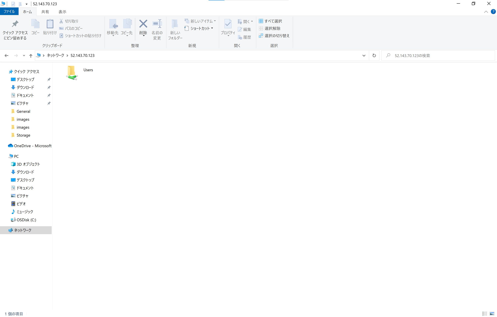
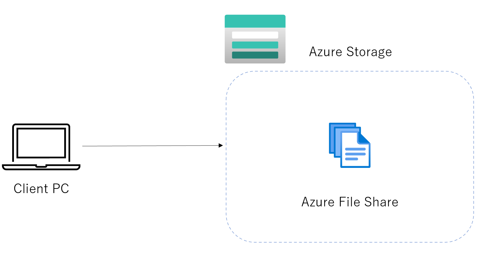

# File Server on Azure

## 目的
- File Server を Azure で運用する際の構成を確認する。

## 前提
- Azure サブスクリプションを保有していること。

## 検証

### 1. Azure VM (Windows) を利用するパターン
作成するアーキテクチャは下記の通り。


IaaS にてファイルサーバを有効化する手順は、[こちら](https://soma-engineering.com/server/windows-server-2019/install-fsrm-2019/2019/05/02/)を参照すること。

ローカルから接続確認をする際は、以下 2 点の設定を Azure にて行う必要がある。

- Subnet の Network Security Group で、特定のポートに対する通信を許可
- ロードバランサの負荷分散規則の追加

#### Subnet の Network Security Group で、特定のポートに対する通信を許可

以下のポートに対する通信を許可する必要がある。

| ポート | プロトコル | 概要 |
|:---:|:---:|:---:|
| 445 / TCP | Direct Hosting of SMB (microsoft-ds) | ファイル、プリンターの共有トラフィックをサポートする。 |

##### 【補足】SMB (Server Message Block)

 Windows で使用されており、 OSI 参照モデル第 7 層アプリケーション層で機能する、標準ファイル共有プロトコル。<br>
LAN を通じてファイル共有やプリンタ共有などを実現する。


（図の引用は[こちら](https://plaza.rakuten.co.jp/nwnote/diary/201802020000/)から。）

| プロトコル | 実装している OS | 機能 |
| :---: | :---: | :--- |
| SMB | MS-Networks <br> LAN Manager <br> Windows for Workgroups <br> Windows NT 3.xなど | 一番基本的なファイル共有プロトコル |
| CIFS | Windows 9x <br> Windows Me <br> Windows NT 4.x | 初期のSMBをベースにオープン規格化されたもの <br> 現在ではCIFSは、SMB 1.0の中に含まれるダイアレクトの一つという扱い |
| SMB1.0 | Windows 2000 <br> Windows XP <br> Windows Server 2003 <br>Windows Server 2003 R2 | CIFSに対する拡張として定義されたプロトコル <br> Kerberos認証やActive Directory対応 <br> 以前のバージョンのファイルやフォルダーへのアクセス <br> スパースファイルやリパースポイント、オフライン、圧縮、暗号化属性などのサポート <br> ※Windows 8.1・Windows Server 2012 R2以降では、「SMB 1.0」機能を削除してセキュリティの向上や不要なコンポーネントの無効化が可能|
| SMB2.1 | Windows 7 <br> Windows Server 2008R2 | 1MbytesのラージMTUのサポート（デフォルトMTUは64Kbytes） <br> クライアントoplockリースモデル <br> スリープモードのサポート <br> ブランチキャッシュサポート |
| SMB3.0 | Windows 8.1 <br> Windows Server 2012 R2 | アンバッファードの読み書き <br> RDMA操作のリモートからのキャンセル <br> スケールアウトファイルサーバークライアントの自動リバランシング <br> スケールアウトファイルサーバー上のマルチプルSMBインスタンスサポート <br> SMB上のHyper-Vライブマイグレーション |
| SMB3.11 | Windows 10 <br> Windows Server 2016 | 暗号化や整合性チェックアルゴリズムのネゴシエーション <br> ネゴシエーションやセッション確立の拡張保護機能 <br> 指定したダイアレクトでの再接続 |

余談だが、CIFS (Common Internet File Systems) というものがある。これは、 SMB をファイル通信プロトコルの標準規格にしたかった Microsoft が、規格として定義したものである（ SMB 1.0 ≒ CIFS というイメージ）。<br>
しかし、 SMB はバージョンを拡張している一方で、 CIFS は標準化には至らなかった。

従来の NetBIOS on TCP では、以下のポートを使用していた。

 - nbname : 137/UDP（ネーミングサービス）
 - nbname : 137/TCP（ネーミングサービス）
 - nbdatagram : 138/UDP（ブラウジング）
 - nbsession : 139/TCP（ファイル / 印刷サービス）

Direct Hosting of SMB により、ユーザはポートの管理を簡略化することができる点でメリットを享受できる。

#### ロードバランサの負荷分散規則の追加

ロードバランサから各ファイルサーバへの通信を許可するため、以下の負荷分散規則を追加する必要がある。

| IP バージョン | フロントエンド IP アドレス | プロトコル | ポート | バックエンドポート | バックエンドプール | 正常性プローブ |
| :---: | :---: | :---: | :---: | :---: | :---: | :---: |
| IPv4 | ロードバランサに割り当てた Public IP アドレス | TCP | 445 | 445 | ファイルサーバが属するバックエンドプール | 445 / TCP に対して確認をする正常性プローブを新規作成 |

ローカルのエクスプローラから、以下を入力することで、接続可能。

```
\\<ロードバランサの IP アドレス>
```

例）ロードバランサの IP アドレスが `52.143.70.123` の場合
```
\\52.143.70.123
```



ファイルサーバ間のレプリケーションは、ファイルサーバ側で DFS (Distributed File System) レプリケーションを設定することで可能（[参考](https://docs.microsoft.com/ja-jp/windows-server/storage/dfs-replication/dfsr-overview)）。

### 2. Azure File Share を利用するパターン


 Azure File Share を作成する手順は、[こちら](https://docs.microsoft.com/ja-jp/azure/storage/files/storage-how-to-create-file-share?tabs=azure-portal)を参照すること。

 作成完了後、 Azure Portal から[接続]をクリックし、 PowerShell を用いた接続文字列を取得する。<br>
 指定する「ドライブ文字」に対し、ローカルにマウントされる。

 ```powershell
> $connectTestResult = Test-NetConnection -ComputerName filesrvstrageaccount.file.core.windows.net -Port 445
>> if ($connectTestResult.TcpTestSucceeded) {
>>     # 再起動時にドライブが維持されるように、パスワードを保存する
>>     cmd.exe /C "cmdkey /add:`"filesrvstrageaccount.file.core.windows.net`" /user:`"Azure\filesrvstrageaccount`" /pass:`"1LHJGNQy77j78jPSIwX2eGfBfsQGuRr8xNcd1Q82iXOszyVm3lBY0Fg/7BGt4Hkr9CYGgmfEsQWRNznUPl6emQ==`""
>>     # ドライブをマウントする
>>     New-PSDrive -Name E -PSProvider FileSystem -Root "\\filesrvstrageaccount.file.core.windows.net\fileshare" -Persist
>> } else {
>>     Write-Error -Message "Unable to reach the Azure storage account via port 445. Check to make sure your organization or ISP is not blocking port 445, or use Azure P2S VPN, Azure S2S VPN, or Express Route to tunnel SMB traffic over a different port."
>> }

CMDKEY: 資格情報を正しく追加しました。

Name           Used (GB)     Free (GB) Provider      Root                                               CurrentLocation
----           ---------     --------- --------      ----                                               ---------------
E                   0.00         10.00 FileSystem    \\filesrvstrageaccount.file.core...
 ```

マウント後、ローカルの E ドライブから確認可能。


試しに、 `hoge.txt` をポータル上からアップロードしてみる。


当然、ローカルからも確認できる。


#### 2-1. Azure File Sync を利用するパターン


Windows ファイルサーバに Azure File Sync エージェントをインストールし、ファイルサーバの容量を拡張する方法は、[こちら](https://docs.microsoft.com/ja-jp/azure/storage/file-sync/file-sync-extend-servers)のドキュメントを参照すること。

Azure File Sync は、マーケットプレイスからデプロイ可能。

Azure File Sync は、ストレージアカウントと同じリソースグループ、同じリージョンにデプロイしないと、ストレージアカウントを指定できない。

Azure File Sync Agent を Windows Server にインストール後、Azure File Sync を登録する画面は下図の通り。


登録が完了すると、下図が表示される。


サーバーエンドポイントに、登録されているサーバー上の特定のディレクトリを指定する。これがマウントポイントとなり、ローカルと同期することが可能となる。

サーバーエンドポイントは、[Azure File Sync] > [同期グループ] . [サーバーエンドポイントの追加] から追加することができる。

追加後の Azure Portal は、下記のように表示される。


Azure Storage アカウントは、 2 章で行った検証と同一のものを指定したため、既にアップロードしている `hoge.txt` が同期される。


試しに、ローカル PC から 仮想 OnP ネットワーク上の VM のマウントポイントに、 `fuga.txt` をアップロードしてみる。


もう一台の仮想 OnP ネットワーク上の VM のマウントポイントでも、別の VM 経由でアップロードしたファイルが同期されていることがわかる。（<b>※画像中の IP アドレスが 2 つの画像で異なる点により、違いがわかる。</b>）


ファイルを以前のバージョンに戻すための運用時は、 Azure File Sync とは別の設定が必要。詳細は[こちら](https://docs.microsoft.com/ja-jp/azure/storage/file-sync/file-sync-deployment-guide?tabs=azure-portal%2Cproactive-portal#self-service-restore-through-previous-versions-and-vss-volume-shadow-copy-service)を参照すること。

<b>※ Azure File Sync を使用する場合、 Azure File Share には、ファイル変更を検知する仕組みがないため、 Azure File Share の直接参照は非推奨。</b>

### 3. Azure NetApp Files を利用するパターン


[WIP] 社内環境では、 Azure NetApp Files に対してサブスクリプションが有効化されていなかった。。。


## 参考
- [ファイル サーバー リソース マネージャー (FSRM) の概要](https://docs.microsoft.com/ja-jp/windows-server/storage/fsrm/fsrm-overview)